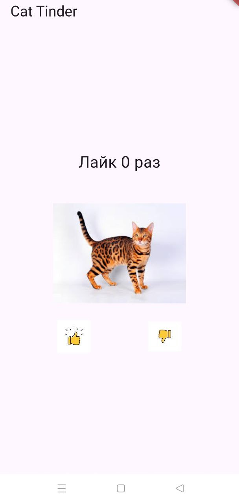
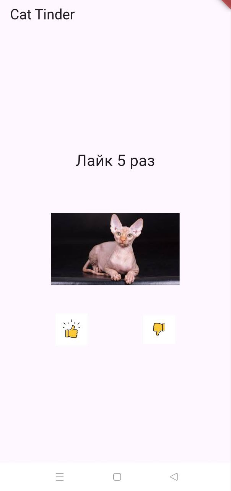
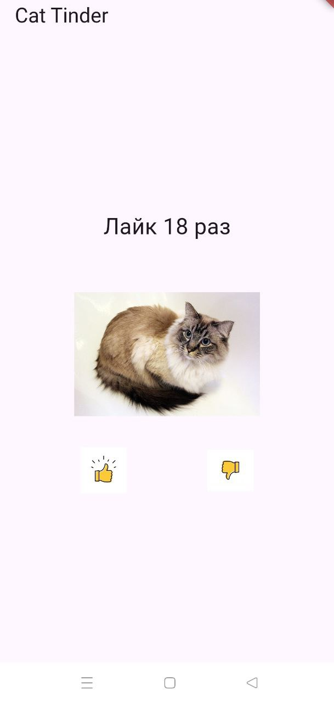

# cat_tinder_mernov

Приложение - тиндер для котиков.

Приложение позволяет пролистывать спсок пород котиков и просматривать подробную информацию о котиках.

Также есть возможность ставить лайки и дизлайки изображениям котиков.

# Список функций:

* Просмотр изображений пород котиков.

* При свайпе вправо/влево изображение (как правило) меняется. Происходит генерация случайного числа - индекса (пока) фиксированного массива - набора пород котиков. В дальнейшем будет обращение к серверу.

* Для некоторых элементов отсутствует фотография и/или название породы. В таких случаях на месте фотографии отображется аватар котика по умолчанию. Таких "пустых" страничек котиков несколько.

* На главной странице есть возможность поставить лайк или дизлайк (большой палец вверх и большой палец вниз соответственно) картинке с котиком. При нажатии на лайк или дизлайк, изображение (как правило) меняется. Происходит генерация случайного числа - индекса фиксированного массива информации про породы котиков. Кнопки лайка и дизлайка являются самостоятельными Stateless виджетами. 

* На главной странице есть счётчик лайков. Счётчик увеличивается при нажатии на большой палец вверх, либо при свайпе изображения аватара влево. При свайпе вправо изображения котика, увеличения счётчика не происходит, а происходит только смена картинки котика.

* При нажатии на изображение котика, отличное от аватара по умолчанию, происходит переход на новую страницу приложения (с использованием Navigator), содержащую название породы, фотографию котика и подробную информацию о породе. При нажатии на картинку - аватар по умолчанию, перехода на новую страницу не произойдёт. 

# Ссылка для скачинвания APK:

* https://github.com/Pavel-Mernov/Flutter-Task-1/releases/tag/v1.0

# Скриншоты работы приложения:

# Дополнительно

* Код отформатирован с помощью *dart format*
